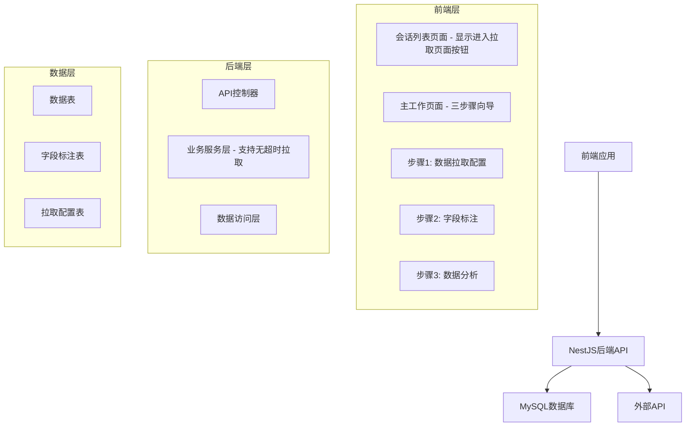

# 设计文档

## 概述

数据拉取与分析系统是一个基于NestJS的全栈应用，采用前后端分离架构。后端提供RESTful API服务，前端使用现代JavaScript框架，通过MySQL数据库进行数据持久化。系统设计遵循模块化、可扩展和可维护的原则。

## 工作流程

系统采用三步骤工作流程：

### 步骤1: 数据拉取配置
- 配置API参数（URL、请求头、查询参数等）
- 执行冒烟测试验证API连接
- 选择拉取模式（分页拉取或全部拉取）
- 开始正式数据拉取，支持进度显示和无超时限制

### 步骤2: 字段标注
- 查看拉取到的数据字段
- 为每个字段添加标注和描述
- 设置字段类型和含义

### 步骤3: 数据分析
- 基于标注的字段进行数据分析
- 创建图表和可视化
- 数据筛选和导出

## 架构

### 整体架构



### 技术栈

- **后端**: NestJS + TypeScript + TypeORM
- **数据库**: MySQL 8.0
- **前端**: React + TypeScript + Axios
- **UI组件库**: Ant Design (提供丰富的表单和表格组件)
- **图表库**: ECharts (支持丰富的图表类型和交互)
- **样式**: Ant Design + 自定义CSS
- **状态管理**: React Context 或 Zustand

### 前端布局设计

#### 响应式布局策略
- **桌面端（>1200px）**: 左右布局，左侧配置区域（30%），右侧数据展示区域（70%）
- **平板端（768px-1200px）**: 上下布局，上方配置区域，下方数据展示区域
- **移动端（<768px）**: 上下布局，配置区域可折叠，优先显示数据区域

#### 页面结构
```
┌─────────────────────────────────────┐
│           导航栏 (步骤指示器)          │
├─────────────────────────────────────┤
│  配置区域                            │
│  ├─ API配置                         │
│  ├─ 拉取模式选择                     │
│  ├─ 分页参数                        │
│  └─ 操作按钮                        │
├─────────────────────────────────────┤
│  数据展示区域                        │
│  ├─ 数据表格 (分页)                  │
│  ├─ 进度指示器                       │
│  └─ 状态信息                        │
└─────────────────────────────────────┘
```

## 冒烟拉取 vs 正式拉取

### 冒烟拉取（Smoke Test）
- **目的**：验证API配置是否正确，测试连接可用性
- **行为**：只拉取少量数据（默认1页），**不存储任何数据**
- **数据处理**：直接返回拉取结果，不进行缓存或持久化
- **用途**：让用户快速验证API连接、认证和基本数据格式
- **界面**：提供"测试拉取"按钮，立即显示拉取结果
- **返回结果**：成功/失败状态 + 样本数据，仅用于验证连接

### 正式拉取（Full Fetch）
- **目的**：拉取完整的数据集用于分析
- **行为**：按照配置的页数范围拉取所有数据，**存储到数据库**
- **数据处理**：所有数据持久化保存到raw_data表
- **用途**：获取完整数据进行后续标注和分析
- **界面**：提供"开始拉取"按钮，执行完整拉取流程并显示进度
- **返回结果**：拉取进度 + 存储状态，数据可用于后续步骤

## 组件和接口

### 前端项目结构

```
frontend/
├── src/
│   ├── components/
│   │   ├── layout/
│   │   │   ├── AppLayout.tsx
│   │   │   ├── StepWizard.tsx        // 步骤向导组件
│   │   │   ├── StepNavigation.tsx    // 步骤导航条
│   │   │   └── ResponsiveContainer.tsx
│   │   ├── data-fetch/
│   │   │   ├── FetchConfigForm.tsx
│   │   │   ├── SmokeTestButton.tsx
│   │   │   ├── FetchModeSelector.tsx
│   │   │   ├── CurlParserModal.tsx    // curl解析弹窗
│   │   │   └── DataPreview.tsx
│   │   ├── history/
│   │   │   ├── SessionList.tsx
│   │   │   ├── SessionCard.tsx
│   │   │   └── SessionDetails.tsx
│   │   ├── field-annotation/
│   │   │   ├── FieldAnnotationForm.tsx
│   │   │   └── FieldList.tsx
│   │   ├── data-analysis/
│   │   │   ├── DataTable.tsx
│   │   │   ├── ChartContainer.tsx
│   │   │   ├── FilterPanel.tsx
│   │   │   └── ChartConfigModal.tsx
│   │   └── common/
│   │       ├── LoadingSpinner.tsx
│   │       ├── ErrorMessage.tsx
│   │       └── ProgressBar.tsx
│   ├── pages/
│   │   ├── MainWorkflowPage.tsx  // 主工作页面，包含三步骤向导
│   │   └── HistoryPage.tsx       // 历史配置页面
│   ├── hooks/
│   │   ├── useDataFetch.ts
│   │   ├── useFieldAnnotation.ts
│   │   └── useDataAnalysis.ts
│   ├── services/
│   │   └── api.ts
│   ├── types/
│   │   └── index.ts
│   └── utils/
│       ├── dataTypeInference.ts
│       ├── chartHelpers.ts
│       └── curlParser.ts          // curl命令解析工具
```

### 后端模块结构

```
src/
├── app.module.ts
├── main.ts
├── config/
│   └── database.config.ts
├── modules/
│   ├── data-fetch/
│   │   ├── data-fetch.module.ts
│   │   ├── data-fetch.controller.ts
│   │   ├── data-fetch.service.ts
│   │   └── dto/
│   ├── field-annotation/
│   │   ├── field-annotation.module.ts
│   │   ├── field-annotation.controller.ts
│   │   ├── field-annotation.service.ts
│   │   └── dto/
│   ├── data-analysis/
│   │   ├── data-analysis.module.ts
│   │   ├── data-analysis.controller.ts
│   │   ├── data-analysis.service.ts
│   │   └── dto/
│   ├── schema-management/
│   │   ├── schema-management.module.ts
│   │   ├── schema-management.service.ts
│   │   └── dto/
│   └── common/
│       ├── http-client/
│       ├── database-utils/
│       └── utils/
└── entities/
    ├── fetch-config.entity.ts
    ├── data-table-schema.entity.ts
    ├── field-annotation.entity.ts
    ├── chart-config.entity.ts
    └── data-session.entity.ts
```

### 核心API接口

#### 数据拉取模块

```typescript
// POST /api/data-fetch/configure
// 作用：保存数据拉取配置，创建数据会话
interface FetchConfigDto {
  apiUrl: string;
  headers: Record<string, string>;
  fetchMode: 'pagination' | 'all'; // 分页模式或全部拉取
  startPage?: number; // 分页模式：开始页码（默认1）
  endPage?: number;   // 分页模式：结束页码（可选，不提供则只拉取startPage）
  pageSize?: number;  // 每页大小（默认20）
}

// POST /api/data-fetch/smoke-test  
// 作用：执行冒烟测试，验证API配置，直接返回结果，不存储数据
interface SmokeTestDto {
  apiUrl: string;
  headers: Record<string, string>;
  pageSize?: number;
}

// 冒烟测试响应（直接返回，无需单独查询接口）
interface SmokeTestResponse {
  success: boolean;
  data: any[]; // 样本数据，仅用于验证
  message?: string; // 成功或错误信息
  error?: string;
}

// POST /api/data-fetch/parse-curl
// 作用：解析curl命令，提取URL、请求头等信息，自动填充配置表单
interface ParseCurlDto {
  curlCommand: string;
}

interface ParseCurlResponse {
  success: boolean;
  config?: {
    apiUrl: string;
    method: string;
    headers: Record<string, string>;
    queryParams?: Record<string, string>;
    body?: any;
  };
  error?: string;
}


// POST /api/data-fetch/execute
// 作用：执行正式数据拉取，将数据存储到数据库，支持分页拉取和进度跟踪
interface ExecuteFetchDto {
  configId: string;
}

// GET /api/data-fetch/status/:sessionId
// 作用：查询正式拉取的进度状态，实时显示拉取进度给用户
interface FetchStatusResponse {
  status: 'pending' | 'running' | 'completed' | 'failed';
  progress: number;
  totalPages: number;
  completedPages: number;
  error?: string;
}

// GET /api/data-fetch/data/:sessionId
// 作用：分页获取已拉取并存储的数据，用于右侧表格展示
interface FetchedDataResponse {
  data: any[];
  pagination: {
    page: number;
    pageSize: number;
    total: number;
  };
}

// GET /api/data-fetch/sessions
// 作用：获取所有数据会话列表，用于历史配置页面
interface SessionListResponse {
  sessions: Array<{
    id: string;
    name: string;
    status: string;
    apiUrl: string;
    fetchMode: string;
    totalRecords?: number;
    createdAt: string;
    updatedAt: string;
  }>;
}

// DELETE /api/data-fetch/session/:sessionId
// 作用：删除指定的数据会话及其相关数据
interface DeleteSessionResponse {
  success: boolean;
  message: string;
}
```

#### 字段标注模块

```typescript
// GET /api/field-annotation/fields/:sessionId
// 作用：获取数据会话中所有字段信息，包含字段类型、建议标注和样本值
interface FieldsResponse {
  fields: Array<{
    name: string;
    type: string;
    suggestedLabel: string;
    sampleValues: any[];
  }>;
}

// POST /api/field-annotation/save
// 作用：保存用户对字段的标注信息，为后续数据分析提供字段含义说明
interface SaveAnnotationsDto {
  sessionId: string;
  annotations: Array<{
    fieldName: string;
    label: string;
    description?: string;
  }>;
}
```

#### 数据分析模块

```typescript
// POST /api/data-analysis/filter
// 作用：根据筛选条件过滤数据，支持多种操作符，返回符合条件的数据
interface FilterDataDto {
  sessionId: string;
  filters: Array<{
    field: string;
    operator: 'eq' | 'ne' | 'gt' | 'lt' | 'in' | 'like';
    value: any;
  }>;
}

// POST /api/data-analysis/chart
// 作用：生成图表数据，支持折线图、柱状图等，可指定X/Y轴字段和聚合方式
interface ChartConfigDto {
  sessionId: string;
  chartType: 'line' | 'bar' | 'pie';
  xAxis: string;
  yAxis: string;
  aggregation?: 'sum' | 'avg' | 'count';
  filters?: FilterDataDto['filters'];
}

// POST /api/data-analysis/chart/save
// 作用：保存图表配置，用户可以保存常用的图表设置并重复使用
interface SaveChartConfigDto {
  sessionId: string;
  name: string;
  chartType: 'line' | 'bar' | 'pie';
  xAxis: string;
  yAxis: string;
  aggregation?: 'sum' | 'avg' | 'count';
  filters?: FilterDataDto['filters'];
}

// GET /api/data-analysis/charts/:sessionId
// 作用：获取会话中保存的所有图表配置列表
interface SavedChartsResponse {
  charts: Array<{
    id: string;
    name: string;
    chartType: string;
    xAxis: string;
    yAxis: string;
    aggregation?: string;
    createdAt: string;
  }>;
}

// GET /api/data-analysis/chart/:chartId
// 作用：根据保存的图表配置生成图表数据
interface ChartDataResponse {
  chartConfig: {
    type: string;
    xAxis: string;
    yAxis: string;
    aggregation?: string;
  };
  data: Array<{
    x: any;
    y: any;
  }>;
}

// GET /api/data-analysis/table/:sessionId
// 作用：获取表格展示数据，包含所有字段和标注信息，支持分页
interface TableDataResponse {
  data: any[];
  fields: Array<{
    name: string;
    label: string;
    type: string;
  }>;
  pagination: {
    page: number;
    pageSize: number;
    total: number;
  };
}
```

## 数据模型

### 数据库表设计

```sql
-- 数据会话表
CREATE TABLE data_sessions (
  id VARCHAR(36) PRIMARY KEY,
  name VARCHAR(255) NOT NULL,
  status ENUM('configuring', 'fetching', 'annotating', 'analyzing', 'completed') DEFAULT 'configuring',
  created_at TIMESTAMP DEFAULT CURRENT_TIMESTAMP,
  updated_at TIMESTAMP DEFAULT CURRENT_TIMESTAMP ON UPDATE CURRENT_TIMESTAMP
);

-- 拉取配置表
CREATE TABLE fetch_configs (
  id VARCHAR(36) PRIMARY KEY,
  session_id VARCHAR(36) NOT NULL,
  api_url TEXT NOT NULL,
  headers JSON,
  fetch_mode ENUM('pagination', 'all') NOT NULL DEFAULT 'pagination',
  start_page INT DEFAULT 1,
  end_page INT NULL, -- NULL表示只拉取start_page页
  page_size INT DEFAULT 20,
  created_at TIMESTAMP DEFAULT CURRENT_TIMESTAMP,
  FOREIGN KEY (session_id) REFERENCES data_sessions(id) ON DELETE CASCADE
);

-- 数据表结构定义表（记录每个会话的数据表结构）
CREATE TABLE data_table_schemas (
  id VARCHAR(36) PRIMARY KEY,
  session_id VARCHAR(36) NOT NULL,
  table_name VARCHAR(255) NOT NULL,
  field_definitions JSON NOT NULL, -- 存储字段定义：{fieldName: {type, nullable, etc}}
  created_at TIMESTAMP DEFAULT CURRENT_TIMESTAMP,
  FOREIGN KEY (session_id) REFERENCES data_sessions(id) ON DELETE CASCADE,
  UNIQUE KEY unique_session_table (session_id, table_name)
);

-- 动态数据表（每个会话会动态创建一个数据表）
-- 表名格式：data_{session_id}
-- 示例结构（根据实际数据动态生成）：
/*
CREATE TABLE data_{session_id} (
  id BIGINT AUTO_INCREMENT PRIMARY KEY,
  fetch_config_id VARCHAR(36) NOT NULL,
  page_number INT NOT NULL,
  data_index INT NOT NULL,
  -- 动态字段（根据API数据结构生成）
  field1 VARCHAR(255),
  field2 INT,
  field3 DECIMAL(10,2),
  field4 DATETIME,
  -- ...更多字段
  created_at TIMESTAMP DEFAULT CURRENT_TIMESTAMP,
  FOREIGN KEY (fetch_config_id) REFERENCES fetch_configs(id) ON DELETE CASCADE,
  INDEX idx_config_page (fetch_config_id, page_number)
);
*/

-- 字段标注表
CREATE TABLE field_annotations (
  id VARCHAR(36) PRIMARY KEY,
  session_id VARCHAR(36) NOT NULL,
  field_name VARCHAR(255) NOT NULL,
  field_type VARCHAR(50) NOT NULL,
  label VARCHAR(255) NOT NULL,
  description TEXT,
  created_at TIMESTAMP DEFAULT CURRENT_TIMESTAMP,
  FOREIGN KEY (session_id) REFERENCES data_sessions(id) ON DELETE CASCADE,
  UNIQUE KEY unique_session_field (session_id, field_name)
);

-- 图表配置表
CREATE TABLE chart_configs (
  id VARCHAR(36) PRIMARY KEY,
  session_id VARCHAR(36) NOT NULL,
  name VARCHAR(255) NOT NULL,
  chart_type ENUM('line', 'bar', 'pie') NOT NULL,
  x_axis VARCHAR(255) NOT NULL,
  y_axis VARCHAR(255) NOT NULL,
  aggregation ENUM('sum', 'avg', 'count', 'none') DEFAULT 'none',
  filters JSON,
  created_at TIMESTAMP DEFAULT CURRENT_TIMESTAMP,
  updated_at TIMESTAMP DEFAULT CURRENT_TIMESTAMP ON UPDATE CURRENT_TIMESTAMP,
  FOREIGN KEY (session_id) REFERENCES data_sessions(id) ON DELETE CASCADE
);
```

### TypeORM实体定义

```typescript
@Entity('data_sessions')
export class DataSession {
  @PrimaryGeneratedColumn('uuid')
  id: string;

  @Column()
  name: string;

  @Column({
    type: 'enum',
    enum: ['configuring', 'fetching', 'annotating', 'analyzing', 'completed'],
    default: 'configuring'
  })
  status: string;

  @CreateDateColumn()
  createdAt: Date;

  @UpdateDateColumn()
  updatedAt: Date;

  @OneToOne(() => FetchConfig, config => config.session)
  fetchConfig: FetchConfig;

  @OneToMany(() => RawData, data => data.session)
  rawData: RawData[];

  @OneToMany(() => FieldAnnotation, annotation => annotation.session)
  fieldAnnotations: FieldAnnotation[];

  @OneToMany(() => ChartConfig, chart => chart.session)
  chartConfigs: ChartConfig[];
}
```

## 错误处理

### 错误分类和处理策略

1. **网络错误**
   - API连接超时：重试机制，最多3次
   - 认证失败：返回明确错误信息
   - 速率限制：实现退避重试

2. **数据验证错误**
   - 无效的API响应格式：记录错误并跳过
   - 字段类型不匹配：自动类型转换或标记为字符串

3. **数据库错误**
   - 连接失败：实现连接池和重连机制
   - 约束违反：提供用户友好的错误信息

4. **业务逻辑错误**
   - 会话不存在：返回404错误
   - 状态不匹配：返回400错误并说明当前状态

### 全局异常过滤器

```typescript
@Catch()
export class GlobalExceptionFilter implements ExceptionFilter {
  catch(exception: unknown, host: ArgumentsHost) {
    const ctx = host.switchToHttp();
    const response = ctx.getResponse();
    
    let status = 500;
    let message = 'Internal server error';
    
    if (exception instanceof HttpException) {
      status = exception.getStatus();
      message = exception.message;
    }
    
    response.status(status).json({
      statusCode: status,
      message,
      timestamp: new Date().toISOString(),
    });
  }
}
```

## 测试策略

### 单元测试

- **服务层测试**: 使用Jest测试所有业务逻辑
- **控制器测试**: 测试API端点的输入输出
- **实体测试**: 验证数据模型的约束和关系

### 集成测试

- **数据库集成**: 使用测试数据库验证数据操作
- **外部API集成**: 使用Mock服务测试API调用
- **端到端测试**: 测试完整的用户流程

### 测试数据管理

```typescript
// 测试数据工厂
export class TestDataFactory {
  static createDataSession(): Partial<DataSession> {
    return {
      name: 'Test Session',
      status: 'configuring'
    };
  }
  
  static createFetchConfig(): Partial<FetchConfig> {
    return {
      apiUrl: 'https://api.example.com/data',
      headers: { 'Authorization': 'Bearer test-token' },
      startPage: 1,
      endPage: 5
    };
  }
}
```

### 性能考虑

1. **数据拉取优化**
   - 并发控制：限制同时进行的API请求数量
   - 批量插入：使用事务批量保存数据
   - 进度跟踪：实时更新拉取进度

2. **查询优化**
   - 数据库索引：为常用查询字段添加索引
   - 分页查询：避免一次性加载大量数据
   - 缓存策略：对字段信息进行缓存

3. **前端优化**
   - 虚拟滚动：处理大量数据的表格展示
   - 图表优化：对大数据集进行采样显示
   - 懒加载：按需加载数据和组件
#
## 冒烟拉取与正式拉取的技术实现差异

#### 冒烟拉取实现
- **完全无痕**：不创建任何数据库记录，不存储任何数据
- **独立执行**：不依赖session或配置，直接使用用户输入的参数
- **即时返回**：同步返回拉取结果，无需后续查询
- **用途**：仅验证API可用性、认证有效性和数据格式

#### 正式拉取实现  
- **数据存储**：持久化到MySQL数据库的raw_data表
- **API设计**：基于已保存的配置执行完整拉取
- **返回数据**：拉取进度和状态信息
- **用途**：获取完整数据集用于后续分析

#### 前端交互流程
1. 用户配置API参数
2. 点击"测试拉取"按钮 → 执行冒烟拉取 → 立即显示成功/失败和样本数据（无痕测试）
3. 测试成功后，点击"开始拉取"按钮 → 保存配置并创建数据会话
4. 系统拉取第一页数据，分析结构并创建专用数据表
5. 继续执行正式拉取，将所有数据存储到专用表
6. 正式拉取完成后，进入字段标注步骤

#### 数据存储优势
- **查询性能**：利用MySQL索引，支持高效的筛选和聚合
- **数据类型**：严格的类型约束，确保数据质量
- **SQL支持**：可以使用复杂的SQL查询进行数据分析
- **扩展性**：支持大数据量的存储和查询
###
 数据拉取逻辑详细说明

#### 拉取模式配置

**分页模式（默认）**
- **界面展示**：默认显示分页设置选项
- **开始页码**：必填，默认为1
- **结束页码**：可选
  - 不填写：只拉取开始页码指定的单页
  - 填写：拉取从开始页码到结束页码的所有页面
- **示例**：
  - startPage=3, endPage=null → 只拉取第3页
  - startPage=1, endPage=5 → 拉取第1-5页
  - startPage=10, endPage=15 → 拉取第10-15页

**全部模式**
- **界面展示**：提供"拉取全部"选项
- **拉取逻辑**：从第1页开始，持续拉取直到API返回空数据或错误
- **停止条件**：
  - API返回空数组
  - API返回错误状态
  - 达到系统设置的最大页数限制（防止无限拉取）

#### 前端界面设计

```
拉取模式：
○ 分页拉取（默认选中）
  开始页码：[1    ] （必填）
  结束页码：[     ] （可选，不填则只拉取开始页）
  
○ 全部拉取
  自动拉取所有可用数据
  
每页大小：[20   ] （默认20）

[测试拉取] [开始拉取]
```

#### API拉取逻辑

```typescript
// 拉取逻辑伪代码
async function executeFetch(config: FetchConfigDto) {
  if (config.fetchMode === 'pagination') {
    const endPage = config.endPage || config.startPage;
    for (let page = config.startPage; page <= endPage; page++) {
      await fetchAndStorePage(page);
    }
  } else if (config.fetchMode === 'all') {
    let page = 1;
    let hasMoreData = true;
    while (hasMoreData && page <= MAX_PAGES) {
      const result = await fetchAndStorePage(page);
      hasMoreData = result.data.length > 0;
      page++;
    }
  }
}
```
##
# 前端布局实现细节

#### 响应式布局组件

```typescript
// ResponsiveContainer.tsx
interface ResponsiveContainerProps {
  configPanel: React.ReactNode;
  dataPanel: React.ReactNode;
  loading?: boolean;
}

const ResponsiveContainer: React.FC<ResponsiveContainerProps> = ({
  configPanel,
  dataPanel,
  loading
}) => {
  const [isMobile, setIsMobile] = useState(false);
  
  useEffect(() => {
    const checkScreenSize = () => {
      setIsMobile(window.innerWidth < 768);
    };
    
    checkScreenSize();
    window.addEventListener('resize', checkScreenSize);
    return () => window.removeEventListener('resize', checkScreenSize);
  }, []);

  return (
    <div className={`layout-container ${isMobile ? 'mobile' : 'desktop'}`}>
      <div className="config-section">
        {configPanel}
      </div>
      <div className="data-section">
        {loading && <LoadingSpinner />}
        {dataPanel}
      </div>
    </div>
  );
};
```

#### CSS布局样式

```css
.layout-container.desktop {
  display: flex;
  height: 100vh;
}

.layout-container.desktop .config-section {
  width: 30%;
  min-width: 400px;
  border-right: 1px solid #e8e8e8;
  padding: 16px;
  overflow-y: auto;
}

.layout-container.desktop .data-section {
  flex: 1;
  padding: 16px;
  overflow-y: auto;
}

.layout-container.mobile {
  display: flex;
  flex-direction: column;
  height: 100vh;
}

.layout-container.mobile .config-section {
  border-bottom: 1px solid #e8e8e8;
  padding: 16px;
  max-height: 40vh;
  overflow-y: auto;
}

.layout-container.mobile .data-section {
  flex: 1;
  padding: 16px;
  overflow-y: auto;
}
```

#### 配置面板折叠功能

```typescript
// CollapsibleConfigPanel.tsx
const CollapsibleConfigPanel: React.FC<{children: React.ReactNode}> = ({children}) => {
  const [collapsed, setCollapsed] = useState(false);
  const isMobile = useMediaQuery('(max-width: 768px)');
  
  return (
    <div className={`config-panel ${collapsed ? 'collapsed' : ''}`}>
      {isMobile && (
        <Button 
          icon={collapsed ? <ExpandOutlined /> : <CollapseOutlined />}
          onClick={() => setCollapsed(!collapsed)}
          className="collapse-btn"
        >
          {collapsed ? '展开配置' : '收起配置'}
        </Button>
      )}
      <div className={`config-content ${collapsed ? 'hidden' : ''}`}>
        {children}
      </div>
    </div>
  );
};
```### 
Curl解析功能设计

#### 功能概述
提供curl命令解析弹窗，用户可以粘贴curl命令，系统自动解析并填充API配置表单，提升配置效率。

#### 前端实现

```typescript
// CurlParserModal.tsx
interface CurlParserModalProps {
  visible: boolean;
  onClose: () => void;
  onParsed: (config: ParsedConfig) => void;
}

const CurlParserModal: React.FC<CurlParserModalProps> = ({
  visible,
  onClose,
  onParsed
}) => {
  const [curlCommand, setCurlCommand] = useState('');
  const [loading, setLoading] = useState(false);

  const handleParse = async () => {
    setLoading(true);
    try {
      const response = await api.post('/data-fetch/parse-curl', {
        curlCommand
      });
      
      if (response.data.success) {
        onParsed(response.data.config);
        onClose();
        message.success('Curl命令解析成功！');
      } else {
        message.error(response.data.error || '解析失败');
      }
    } catch (error) {
      message.error('解析过程中发生错误');
    } finally {
      setLoading(false);
    }
  };

  return (
    <Modal
      title="Curl命令解析"
      open={visible}
      onCancel={onClose}
      footer={[
        <Button key="cancel" onClick={onClose}>
          取消
        </Button>,
        <Button 
          key="parse" 
          type="primary" 
          loading={loading}
          onClick={handleParse}
          disabled={!curlCommand.trim()}
        >
          解析并填充
        </Button>
      ]}
      width={800}
    >
      <div className="curl-parser-content">
        <div className="mb-4">
          <Text type="secondary">
            粘贴您的curl命令，系统将自动解析URL、请求头等信息并填充到配置表单中
          </Text>
        </div>
        
        <TextArea
          value={curlCommand}
          onChange={(e) => setCurlCommand(e.target.value)}
          placeholder={`请粘贴curl命令，例如：
curl -X GET "https://api.example.com/data?page=1&size=20" \\
  -H "Authorization: Bearer your-token" \\
  -H "Content-Type: application/json"`}
          rows={8}
          className="curl-input"
        />
        
        <div className="mt-2">
          <Text type="secondary" className="text-sm">
            支持解析：URL、请求方法、请求头、查询参数等
          </Text>
        </div>
      </div>
    </Modal>
  );
};
```

#### 后端解析实现

```typescript
// curl-parser.service.ts
@Injectable()
export class CurlParserService {
  parseCurlCommand(curlCommand: string): ParsedCurlConfig {
    try {
      // 清理命令，移除换行符和多余空格
      const cleanCommand = curlCommand
        .replace(/\\\s*\n\s*/g, ' ')
        .replace(/\s+/g, ' ')
        .trim();

      // 提取URL
      const urlMatch = cleanCommand.match(/curl\s+(?:-X\s+\w+\s+)?["']?([^"'\s]+)["']?/);
      if (!urlMatch) {
        throw new Error('无法解析URL');
      }

      const url = urlMatch[1];
      const urlObj = new URL(url);
      
      // 提取请求方法
      const methodMatch = cleanCommand.match(/-X\s+(\w+)/i);
      const method = methodMatch ? methodMatch[1].toUpperCase() : 'GET';

      // 提取请求头
      const headers: Record<string, string> = {};
      const headerMatches = cleanCommand.matchAll(/-H\s+["']([^"']+)["']/g);
      
      for (const match of headerMatches) {
        const headerLine = match[1];
        const colonIndex = headerLine.indexOf(':');
        if (colonIndex > 0) {
          const key = headerLine.substring(0, colonIndex).trim();
          const value = headerLine.substring(colonIndex + 1).trim();
          headers[key] = value;
        }
      }

      // 提取查询参数
      const queryParams: Record<string, string> = {};
      urlObj.searchParams.forEach((value, key) => {
        queryParams[key] = value;
      });

      // 提取请求体
      let body = null;
      const dataMatch = cleanCommand.match(/-d\s+["']([^"']+)["']/);
      if (dataMatch) {
        try {
          body = JSON.parse(dataMatch[1]);
        } catch {
          body = dataMatch[1];
        }
      }

      return {
        success: true,
        config: {
          apiUrl: `${urlObj.protocol}//${urlObj.host}${urlObj.pathname}`,
          method,
          headers,
          queryParams: Object.keys(queryParams).length > 0 ? queryParams : undefined,
          body
        }
      };
    } catch (error) {
      return {
        success: false,
        error: `解析失败: ${error.message}`
      };
    }
  }
}
```

#### 配置表单集成

```typescript
// FetchConfigForm.tsx 中的集成
const FetchConfigForm: React.FC = () => {
  const [form] = Form.useForm();
  const [curlModalVisible, setCurlModalVisible] = useState(false);

  const handleCurlParsed = (config: ParsedConfig) => {
    // 自动填充表单
    form.setFieldsValue({
      apiUrl: config.apiUrl,
      headers: Object.entries(config.headers).map(([key, value]) => ({
        key,
        value
      }))
    });

    // 如果有查询参数，可以提示用户或自动处理分页参数
    if (config.queryParams) {
      const { page, size, limit, offset } = config.queryParams;
      if (page) form.setFieldValue('startPage', parseInt(page));
      if (size || limit) form.setFieldValue('pageSize', parseInt(size || limit));
    }
  };

  return (
    <Form form={form} layout="vertical">
      <div className="form-header">
        <Button 
          type="dashed" 
          icon={<ImportOutlined />}
          onClick={() => setCurlModalVisible(true)}
          className="mb-4"
        >
          从Curl命令导入
        </Button>
      </div>

      {/* 原有的表单字段 */}
      <Form.Item label="API URL" name="apiUrl" required>
        <Input placeholder="https://api.example.com/data" />
      </Form.Item>

      {/* 其他表单字段... */}

      <CurlParserModal
        visible={curlModalVisible}
        onClose={() => setCurlModalVisible(false)}
        onParsed={handleCurlParsed}
      />
    </Form>
  );
};
```

#### 支持的Curl特性

1. **基本URL解析**：提取完整的API端点
2. **请求方法**：支持GET、POST、PUT、DELETE等
3. **请求头解析**：自动提取Authorization、Content-Type等
4. **查询参数**：解析URL中的查询参数，智能识别分页参数
5. **请求体**：解析JSON或文本格式的请求体
6. **多行命令**：支持反斜杠换行的curl命令

#### 用户体验优化

1. **智能提示**：提供常见curl命令格式的示例
2. **错误处理**：详细的解析错误提示和建议
3. **预览功能**：解析后显示提取的配置信息供用户确认
4. **一键填充**：解析成功后自动填充所有相关表单字段